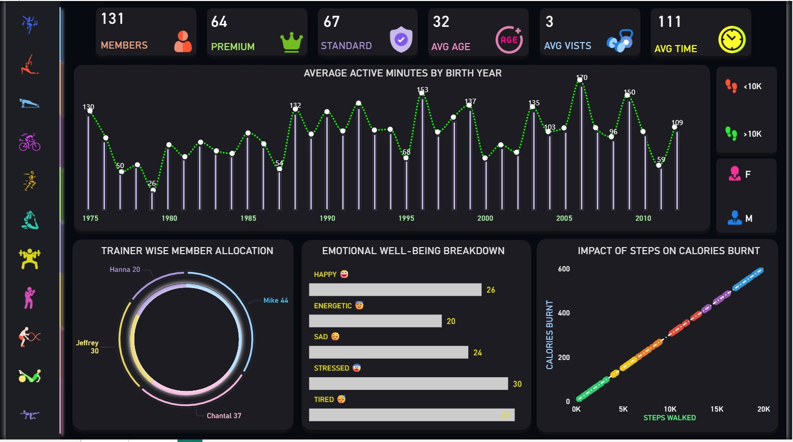

# 🏋️ Gym Membership Analytics Dashboard


An interactive **Power BI dashboard** designed to analyze gym membership trends, trainer allocation, member engagement, wellness metrics, and fitness performance.
A visually interactive **Power BI Dashboard** designed to analyze gym member activity, membership plans, trainer allocation, emotional well-being, and fitness performance.

This dashboard helps gym owners and managers monitor member engagement, identify trends, and make data-driven decisions to improve customer experience and business growth.

---

# 📊 Dashboard Preview




---

# 📌 Project Overview

The Gym Membership Analytics Dashboard provides a complete overview of gym operations through interactive visualizations and KPIs. It combines member demographics, activity tracking, trainer assignments, and wellness metrics into a single dashboard for easy monitoring.

---

# 🎯 Business Objectives

- Monitor gym membership statistics
- Track member engagement and workout activity
- Analyze premium vs standard memberships
- Measure member wellness and activity trends
- Evaluate trainer workload distribution
- Study the relationship between physical activity and calories burnt

---

# 📈 Dashboard KPIs

| KPI | Value |
|------|------:|
| Total Members | **131** |
| Premium Members | **64** |
| Standard Members | **67** |
| Average Age | **32 Years** |
| Average Visits | **3 Visits** |
| Average Active Minutes | **111 Minutes** |

---

# 📊 Dashboard Visualizations

## 👥 Membership Overview

Displays the overall gym population along with:

- Total Members
- Premium Members
- Standard Members
- Average Member Age
- Average Visits
- Average Active Minutes

These KPIs provide a quick snapshot of the gym's overall performance.

---

## 📅 Average Active Minutes by Birth Year

A combined Column + Line Chart showing:

- Average workout duration
- Birth-year wise activity levels
- Trends across different age groups

This helps identify which age groups are most active.

---

## 🧑‍🏫 Trainer-wise Member Allocation

A Donut Chart displaying member distribution among trainers.

Current allocation includes:

- Mike
- Chantal
- Jeffrey
- Hanna

This visualization helps balance trainer workload and improve member management.

---

## 😊 Emotional Well-being Breakdown

Tracks members based on their emotional state:

- Happy 😀
- Energetic 🤩
- Sad 😔
- Stressed 😨
- Tired 😴

This provides additional insights into member wellness beyond physical activity.

---

## 🔥 Impact of Steps on Calories Burnt

Scatter Plot illustrating the relationship between:

- Steps Walked
- Calories Burnt

The dashboard clearly demonstrates a positive correlation between physical activity and calorie expenditure.

---

# 🎛 Interactive Features

- Dynamic Filters
- Dark Theme Dashboard
- Fitness-themed Icons
- Interactive Visualizations
- KPI Cards
- Responsive Layout

---

# 🛠 Tools & Technologies

- Microsoft Power BI
- Power Query
- DAX
- Microsoft Excel
- Data Modeling
- Data Visualization

---

# 💡 Key Insights

- Premium and Standard memberships are nearly equally distributed.
- Average member age is **32 years**, indicating a young and active customer base.
- Members spend approximately **111 active minutes** during workouts.
- Trainer allocation helps identify workload distribution.
- Emotional well-being metrics provide an additional layer of member engagement analysis.
- Higher daily step counts are associated with increased calories burnt.

---

# 📂 Project Structure

```
Gym-Membership-Dashboard/
│
├── Gym_Dashboard.pbix
├── README.md
├── images/
│   └── dashboard.png
└── dataset.xlsx
```

---

# 🚀 Skills Demonstrated

- Data Cleaning
- Data Transformation
- Data Modeling
- DAX Measures
- KPI Design
- Dashboard Development
- Business Intelligence
- Data Visualization
- Interactive Reporting
- Analytical Thinking

---

# 📈 Business Value

This dashboard enables gym management to:

- Monitor overall gym performance
- Understand member demographics
- Improve trainer allocation
- Increase customer engagement
- Identify fitness activity trends
- Support data-driven business decisions

---

# 👨‍💻 Author

**Srikanth Narra**

- GitHub: https://github.com/YOUR_USERNAME
- LinkedIn: https://linkedin.com/in/YOUR_LINKEDIN

---

⭐ If you found this project helpful, feel free to star the repository!
